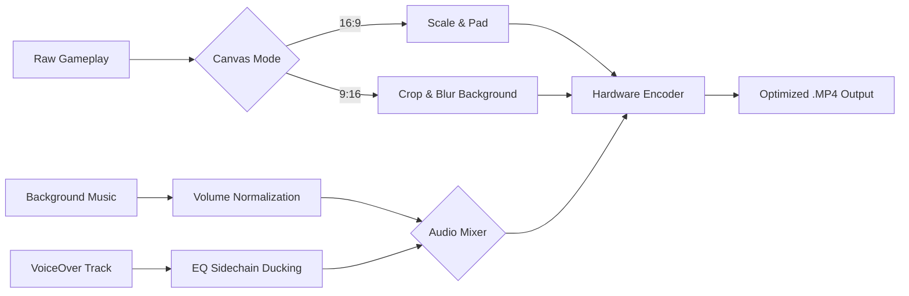

<div align="center">


[](https://dotnet.microsoft.com/)
[](https://avaloniaui.net/)
[](https://ffmpeg.org/)
[](#)
[](https://opensource.org/licenses/MIT)

</div>

<h3 align="center">A high-performance, ultra-specialized non-linear video editing (NLE) pipeline engineered for automated gaming montage creation.</h3>

<p align="center">
  <a href="#-architecture--innovations">Architecture</a> •
  <a href="#-core-capabilities">Core Capabilities</a> •
  <a href="#-technical-deep-dive">Technical Deep Dive</a> •
  <a href="#%EF%B8%8F-build-instructions">Build Instructions</a>
</p>

---

## âš¡ The Vision

**Fortnite Video Software (FVS)** is not just another wrapper around FFmpeg. It is a **production-grade video processing application** built from the ground up in **C# 11 and .NET 9**. 

By orchestrating complex FFmpeg filter graphs, custom D3D11 hardware-accelerated playback (`libmpv`), and an ultra-responsive Avalonia UI frontend, FVS abstracts hours of manual video editing into a lightning-fast, highly optimized workflow. 

Originally ported from a legacy Python codebase, this application has been completely re-engineered into a memory-safe, **NativeAOT-compiled** monolith. It boasts zero-dependency deployment, sub-second startup times, and unparalleled rendering performance.

---

## 🧠 Architecture & Innovations

### 1. Robust Inter-Process Communication (IPC)
The application leverages a sophisticated IPC architecture utilizing Named Pipes and Mutexes. This allows seamless communication between the frontend Avalonia host and the `libmpv` video rendering backend without blocking the UI thread.

### 2. Auto-Detecting Hardware Acceleration
A custom-built `HardwareScanner` probes the user's system at runtime. It identifies the optimal GPU encoder pipeline (NVIDIA `nvenc`, AMD `amf`, Intel `qsv`, or `d3d11va`) and dynamically injects the precise hardware flags into the FFmpeg compilation chain.

### 3. Fault-Tolerant Crash Recovery 
Never lose your work. FVS employs a deterministic `recovery_v2.json` state machine. Every trim, crop, UI bounds change, and configuration tweak is serialized asynchronously. If the application or GPU drivers crash, the state is instantly restored upon reboot.

### 4. Frequency Probing & Audio Ducking
Say goodbye to manual audio mixing. FVS features a dedicated `FrequencyProber` that parses the original video's audio waveforms, detects vocal frequency ranges (e.g., Adult Male, Female, Child), and automatically computes optimal EQ sidechain ducking when layering background music or custom voiceovers.

---

## 🔥 Core Capabilities

| Feature | Description |
| --- | --- |
| **🎬 Zero-Latency Trimming** | Mark start (`[`) and end (`]`) points effortlessly using our direct `libmpv` D3D11 shared-texture playback engine. Scrubbing is instantaneous. |
| **📱 Intelligent Portrait Mode** | One-click "Canvas Trick" dynamically recalculates matrices to adapt 16:9 gameplay into a sleek 1080x1920 portrait format for TikTok/Shorts/Reels. |
| **ðŸŽ™ï¸  VoiceOver Studio** | A fully featured recording module utilizing `NAudio`. Records isolated vocal tracks, generates real-time waveform visuals, and synchronizes them with the timeline. |
| **🎵 Multi-Track Mixing** | Add custom music, adjust relative volumes, apply fade-ins/fade-outs, and let the automated sidechain compression handle the mastering. |
| **ðŸ–Œï¸  Aesthetic UI/UX** | Dark-themed, GPU-accelerated interface. Features dynamic gradient rendering, smooth micro-animations, and realistic 3D tactile buttons. |

---

## 🔬 Technical Deep Dive

### The FFmpeg Filter Graph
FVS doesn't just run simple FFmpeg commands; it constructs complex, multi-stage `filter_complex` graphs dynamically based on the user's session state.



### Native AOT Compilation
FVS is built for the future of .NET. By utilizing `PublishAot=true`, the entire application and its dependencies (including the JSON source generators that bypass reflection) are pre-compiled into native machine code. 
- **Footprint:** Drastically reduced memory usage.
- **Speed:** Instant JIT-free startup.
- **Portability:** A single, self-contained `.exe` payload.

---

## âš™ï¸  Build Instructions

To compile the application from source, you will need the **.NET 9 SDK** and the **Desktop Development with C++** workload installed (required for the AOT linker).

1. Clone the repository:
   ```bash
   git clone https://github.com/alonreich/FortniteVideoSoftware.git
   cd FortniteVideoSoftware
   ```

2. Run the automated build script:
   ```cmd
   .\build.cmd
   ```

3. The script will clean the environment, resolve all NuGet dependencies, trigger the Roslyn source generators, and output the NativeAOT compiled executable to:
   ```
   .\compiled\FortniteVideoSoftware.exe
   ```

> **Note:** Development watch mode (Hot Reload) is available via `.\dev.cmd` for rapid UI iteration without rebuilding the entire AOT binary.

---

## ðŸ›¡ï¸  License & Maintainer

Engineered with passion and precision.

**Developer:** [alonreich](https://github.com/alonreich)  
**License:** MIT License

<p align="center">
  <i>"Writing code is easy. Designing a flawless, crash-proof video pipeline is an art."</i>
</p>

<div align="center">
  
</div>
