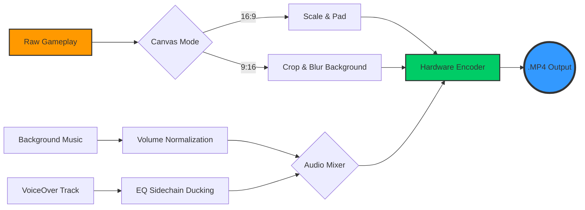

<div align="center">


<p align="center">
  <a href="https://dotnet.microsoft.com/"></a>
  <a href="https://avaloniaui.net/"></a>
  <a href="https://ffmpeg.org/"></a>
  <a href="#"></a>
  <a href="https://opensource.org/licenses/MIT"></a>
</p>

<h3 align="center">⚡ High-Performance, Ultra-Specialized NLE Engineered for Automated Gaming Content Creation.</h3>

<p align="center">
  
</p>

</div>

---

## 🌪️ The Vision

**Fortnite Video Software (FVS)** is not just another wrapper around FFmpeg. It is a **production-grade video processing powerhouse** built from the ground up in **C# 13 and .NET 9**. 

By orchestrating complex FFmpeg filter graphs, custom D3D11 hardware-accelerated playback (`libmpv`), and an ultra-responsive Avalonia UI frontend, FVS abstracts hours of manual video editing into a **lightning-fast, highly optimized workflow**. 

Originally ported from a legacy Python codebase, this application has been completely re-engineered into a memory-safe, **NativeAOT-compiled** monolith. It boasts zero-dependency deployment, sub-second startup times, and unparalleled rendering performance.

---

## 💥 Core Capabilities

> **FVS redefines what an automated video editor can do by keeping everything on the GPU.**

| 🚀 Feature | ✨ Description |
| :--- | :--- |
| **🎬 Zero-Latency Trimming** | Mark start (`[`) and end (`]`) points effortlessly using our direct `libmpv` D3D11 shared-texture playback engine. **Scrubbing is instantaneous.** |
| **📱 Intelligent Portrait Mode** | One-click "Canvas Trick" dynamically recalculates matrices to adapt 16:9 gameplay into a sleek 1080x1920 portrait format for TikTok/Shorts/Reels. |
| **🎙️ VoiceOver Studio** | A fully featured recording module utilizing `NAudio`. Records isolated vocal tracks, generates real-time waveform visuals, and synchronizes them instantly with the timeline. |
| **🎵 Multi-Track Mixing** | Add custom music, adjust relative volumes, apply fade-ins/fade-outs, and let the automated sidechain compression handle the mastering. |
| **🖌️ Aesthetic UI/UX** | Dark-themed, GPU-accelerated interface. Features dynamic gradient rendering, smooth micro-animations, and realistic 3D tactile buttons. |

---

## 🧠 Architecture & Innovations

🔹 **Robust Inter-Process Communication (IPC)**  
The application leverages a sophisticated IPC architecture utilizing Named Pipes and Mutexes. This allows seamless communication between the frontend Avalonia host and the `libmpv` video rendering backend without blocking the UI thread.

🔹 **Auto-Detecting Hardware Acceleration**  
A custom-built `HardwareScanner` probes the user's system at runtime. It identifies the optimal GPU encoder pipeline (NVIDIA `nvenc`, AMD `amf`, Intel `qsv`, or `d3d11va`) and dynamically injects the precise hardware flags into the FFmpeg compilation chain.

🔹 **Fault-Tolerant Crash Recovery**  
Never lose your work. FVS employs a deterministic `app_session.lock` state machine. Every trim, crop, UI bounds change, and configuration tweak is serialized asynchronously. If the application or GPU drivers crash, the state is instantly restored upon reboot.

🔹 **Frequency Probing & Audio Ducking**  
Say goodbye to manual audio mixing. FVS features a dedicated `FrequencyProber` that parses the original video's audio waveforms, detects vocal frequency ranges (e.g., Adult Male, Female, Child), and automatically computes optimal EQ sidechain ducking when layering background music or custom voiceovers.

---

## 🔬 Technical Deep Dive

### 1. The FFmpeg Filter Graph
FVS doesn't just run simple FFmpeg commands; it constructs complex, multi-stage `filter_complex` graphs dynamically based on the user's session state.



### 2. Native AOT Compilation
FVS is built for the future of .NET. By utilizing `PublishAot=true`, the entire application and its dependencies (including the JSON source generators that bypass reflection) are pre-compiled into native machine code. 
- 🔋 **Footprint:** Drastically reduced memory usage.
- ⚡ **Speed:** Instant JIT-free startup.
- 📦 **Portability:** A single, self-contained `.exe` payload.

---

## ⚙️ Build Instructions

To compile the application from source, you will need the **.NET 9 SDK** and the **Desktop Development with C++** workload installed (required for the AOT linker).

```bash
# 1. Clone the repository
git clone https://github.com/alonreich/FortniteVideoSoftware.git
cd FortniteVideoSoftware

# 2. Run the automated build script
.\build.cmd
```

> **💡 Pro Tip:** Development watch mode (Hot Reload) is available via `.\dev.cmd` for rapid UI iteration without rebuilding the entire AOT binary. The final executable will be located in `.\compiled\FortniteVideoSoftware.exe`.

---

## 🛡️ License & Maintainer

Engineered with passion and precision by **[alonreich](https://github.com/alonreich)**.  
Released under the **MIT License**.

<div align="center">
  <br>
  <i>"Writing code is easy. Designing a flawless, crash-proof video pipeline is an art."</i>
  <br><br>
  
</div>
